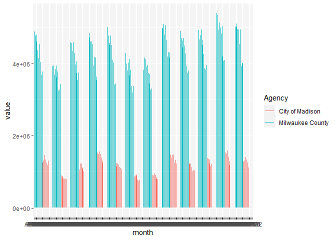

<!-- README.md is generated from README.Rmd. Please edit that file -->

# ntdr: Retrieve data from the National Transit Database

<!-- badges: start -->
<!-- badges: end -->

The `ntdr` package provides a convenient interface to retrieve monthly
data from the National Transit Database (NTD). Without this package,
getting NTD data involves going to the NTD website and downloading and
processing a complex Excel workbook.

## Installation

You can install the development version of ntdr from Github:

``` r
devtools::install_github()
```

## Example

Basic usage:

``` r
library(ntdr)
ntd_madison <- get_ntd(data_type = "adjusted", ntd_variable = "UPT", agency = "City of Madison", modes = "MB")
head(ntd_madison)
#> # A tibble: 6 × 12
#>   5 digit …¹ 4 dig…² Agency Active Repor…³   UZA UZA N…⁴ Modes TOS   month value
#>        <dbl> <chr>   <chr>  <chr>  <chr>   <dbl> <chr>   <chr> <chr> <chr> <dbl>
#> 1      50005 5005    City … Inact… Full R…    92 Madiso… DR    DO    JAN02  5629
#> 2      50005 5005    City … Inact… Full R…    92 Madiso… DR    DO    FEB02  5137
#> 3      50005 5005    City … Inact… Full R…    92 Madiso… DR    DO    MAR02  5665
#> 4      50005 5005    City … Inact… Full R…    92 Madiso… DR    DO    APR02  5607
#> 5      50005 5005    City … Inact… Full R…    92 Madiso… DR    DO    MAY02  5866
#> 6      50005 5005    City … Inact… Full R…    92 Madiso… DR    DO    JUN02  5167
#> # … with 1 more variable: date <date>, and abbreviated variable names
#> #   ¹​`5 digit NTD ID`, ²​`4 digit NTD ID`, ³​`Reporter Type`, ⁴​`UZA Name`
```

The data are returned in a long format, which makes it easy to create
plots and do other cool things:

``` r
library(ggplot2)
get_ntd(agency = c("City of Madison", "Milwaukee County"), modes = "MB") |> 
  ggplot(aes(month, value, color = Agency)) +
  geom_line()
#> Warning: Removed 244 rows containing missing values (`geom_line()`).
```


